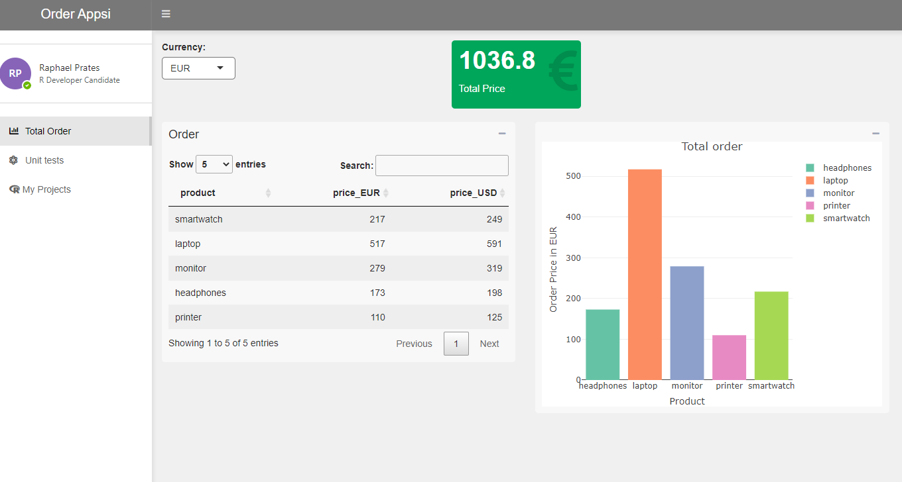

R Shiny app
================
Raphael Prates
14/02/2022

This project seems to join <https://github.com/raphaelDuff/order> with
<https://github.com/raphaelDuff/orderShiny>, creating an R Shiny app
with unit tests and views separated in modules.

The app contains 3 tabs:

-   Total Order: displaying an input select, data table and reactive
    value box and a ploty plot;
-   Unit tests: a solution of a coding exercise about unit tests;
-   My Projects: other projects developed when I was working at LG

